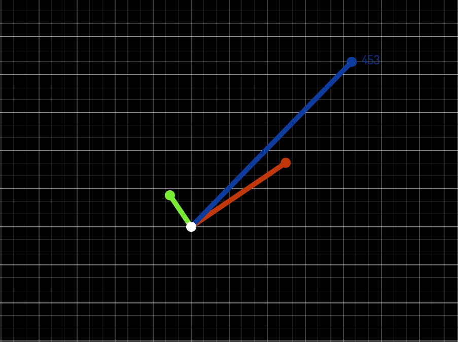

# StrafeVisualizer
 
 

 

An interactive animation application that visualizes movement for strafe based video games (ex. CS:GO and CS:S).

This application was used for animations for [this](http://youtube.com) video!

### Screenshot of the Strafe Visualizer

### Download
Download the [latest release](https://github.com/spicy/StrafeVisualizer/releases/latest) to test various inputs and learn how CS:S/CS:GO movement works.

## FAQ
### How do I move to the next animation?
Press <kbd>SPACE</kbd>

## Building
Dependencies: `SFML 2`, `Eigen 3`.

Building with CMake:

* `mkdir build`
* `cd build`
* `cmake ..`
* `make`

## Acknowledgments

*   [HackerPoet](https://github.com/https://github.com/HackerPoet/Conics) for structure, inspiration, and DrawUtil source code.

## License
> Copyright (c) 2020-2022 Daniel Currey

This project is licensed under the [MIT License](https://opensource.org/licenses/mit-license.php) - see the [LICENSE](https://github.com/spicy/StrafeVisualizer/LICENSE) file for details.
